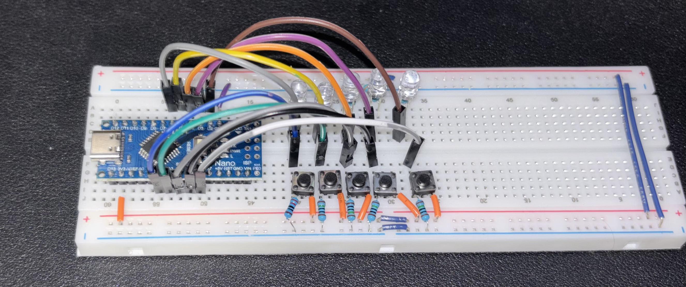
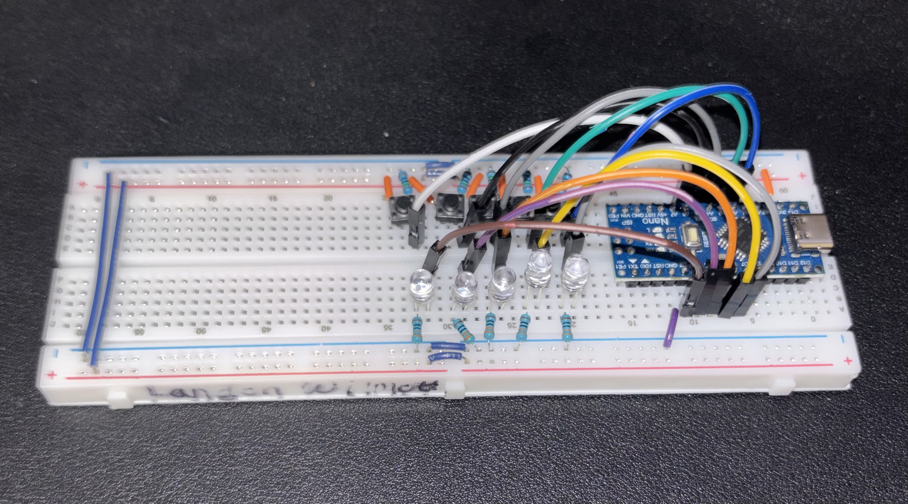

# Arduino Lab 2: Robot Logic Control

## Project Objective
This project focuses on developing the foundational control logic for a future robot. Using an Arduino, the system interprets inputs from multiple sensors (simulated by push buttons) to determine movement and collision avoidance behavior.

## Skills and Technology Used
* **Language:** C++ (Arduino Sketch)
* **Hardware:** GPIO Pin Mapping, Pull-up/Pull-down Resistors, LED Logic Indicators
* **Tools:** Arduino IDE, Circuit Breadboarding

## How It Works
The logic is divided into three primary zones to simulate sensor input:
* **Middle Button:** Acts as a collision override. When triggered, it halts other operations to prioritize safety logic.
* **Left & Right Buttons:** Control the primary directional logic, representing the light sensors or proximity triggers.
* **Far-Left & Far-Right:** Handle extreme-angle detection for tighter maneuvering.

## Requirements
* 1x Arduino Uno (or compatible board)
* 5x Push Buttons
* 5x Resistors (330 Ohm)
* 5x Resistors (150 Ohm)
* LED Indicators
* Breadboard and Jumper Wires

## Circuit Documentation

